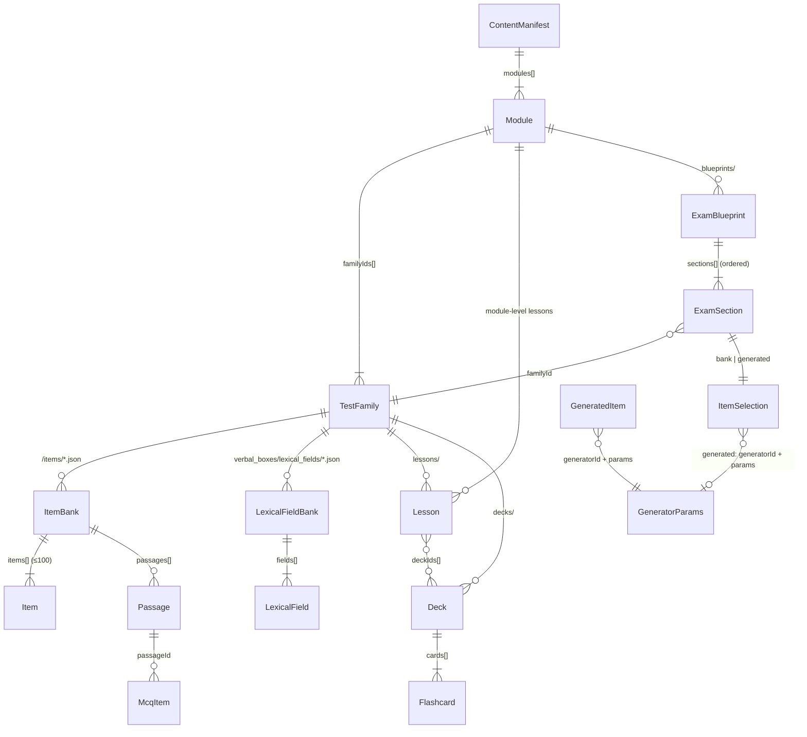
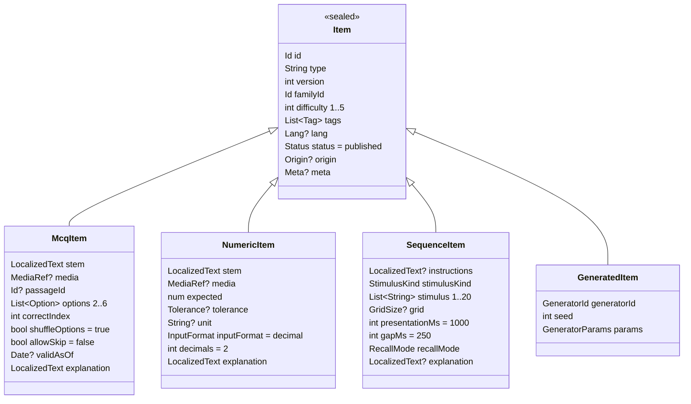

# Content contract (US-010, v2 in US-015) — schemaVersion 2

The single model shared by the activity engines (EPIC-03), the learn UI (EPIC-04), the exam
runner (EPIC-06), the local database (EPIC-02) and the content authors (EPIC-08).
Machine-readable rules: [`schema/*.schema.json`](schema/) (JSON Schema draft 2020-12).
Author-facing rules: [AUTHORING.md](AUTHORING.md). Valid samples:
[`assets/content/examples/`](../../assets/content/examples/); real files under
[`assets/content/psy0/`](../../assets/content/psy0/) (families, blueprints).

Status: **v2** — the JSON contract (schemas + examples), the Dart models
(`lib/core/content/`, freezed + json_serializable) and the round-trip tests against every
example and every real file are in place. §6 lists the types and where they live; §8 is the
v1 → v2 diff.

## 1. Entities



| Entity | File | Schema | Notes |
|---|---|---|---|
| `ContentManifest` | `assets/content/manifest.json` | `manifest.schema.json` | `schemaVersion` (**2**), `contentVersion`, `modules`, `changelog` |
| `Module` | `<module>/module.json` | `family.schema.json#/$defs/Module` | `psy0` / `psy1` / `psy2`; ordered `familyIds` (the 14 PSY0 activities + English sub-tests), `defaultBlueprintId` |
| `TestFamily` | `<module>/families/<family>.json` | `family.schema.json` | `engineType` = the family id, `generatorId?`, `answerFormat`, `inputRequirement`, `liveFeedback`, `default*` (duration, item count, per-item time, cadence), `confidence` |
| `ItemBank` (file) | `<module>/<family>/items/*.json` | `bank.schema.json` | `familyId`, `passages[]`, `items[]` (1–100) |
| `Item` (sealed) | inside a bank | `item.schema.json` | discriminator `type` |
| `Passage` | inside a bank | `item.schema.json#/$defs/Passage` | shared reading text (or audio for listening) |
| `GeneratorParams` (sealed) | inside a `GeneratedItem` or a generated `ItemSelection` | `generators.schema.json` | typed per `generatorId`; every key has a real-test default |
| `LexicalFieldBank` + `LexicalField` | `<module>/verbal_boxes/lexical_fields/*.json` | `lexical_fields.schema.json` | French lexical fields for *Boîte à mots* (US-085) |
| `Lesson` | `<module>/(<family>/)lessons/*.json` (+ `.md`) | `lesson.schema.json` | `body` inline **or** `file` refs |
| `Deck` + `Flashcard` | `<module>/<family>/decks/*.json` | `deck.schema.json`, `flashcard.schema.json` | cards inline in the deck |
| `ExamBlueprint` + `ExamSection` | `<module>/blueprints/*.json` | `blueprint.schema.json` | sections ordered; timing = section time / per-item time / cadence; `scoringPolicy`, `liveFeedback`, `inputRequirement` |

Common value types (`common.schema.json`): `Id`, `ModuleId`, `Version`, `Difficulty` (1–5),
`Tag`/`Tags`, `LocalizedText`, `LocalizedPath`, `AssetPath`, `MediaRef`, `Confidence`,
`Lang`, `Meta` (+ `Source`), `Status`, and (v2) `GridSize`, `Cadence`, `ScoringPolicy`,
`InputRequirement`.

Every content entity carries `id` and `version`; items, flashcards and lexical fields also
carry `difficulty` and `tags` (mandatory); lessons, decks, families and blueprints carry
`tags` and an optional `difficulty` where it makes sense (lesson level).

## 2. The sealed `Item` hierarchy



Design rules:

- **`type` is the discriminator** (`mcq` | `numeric` | `sequence` | `generated`) — in Dart a
  freezed union with `unionKey: 'type'`.
- **Every concrete item is self-scoring**: `McqItem.correctIndex`, `NumericItem.expected` +
  `tolerance`, `SequenceItem.stimulus` + `recallMode`. The engine's `Scorer` never needs
  anything outside the item — except the section's `scoringPolicy` (points, not correctness).
- **`GeneratedItem` is a recipe, not a question.** The runtime asks the generator registered
  under `generatorId` (US-020) to *materialise* it with `seed` and the typed `params` into an
  engine-owned item (an `McqItem`/`NumericItem` for dominos, viewpoint, tubes; an interactive
  item the engine renders itself for n-back, rules, parity, overlay, airways, word boxes,
  grids, cube nets, multitask) whose `origin = {generatorId, seed}` and whose id is
  `gen.<generatorId>.<seed>`. Materialised items are never written to bank files; attempts
  store `origin` so they can be replayed (US-011). **Same `(generatorId, seed, params)` ⇒
  same item**, always.
- **`params` is typed per generator** (§3). In JSON it is a plain object next to
  `generatorId`; in Dart it is the sealed `GeneratorParams` union, decoded by injecting the
  sibling `generatorId` (`readGeneratorParams`) and serialised without it
  (`generatorParamsToJson`). Omitted keys take the real-test defaults, so `params: {}` is
  always valid and `GeneratorParams.defaultsFor(id)` is the real test.
- **`McqItem.allowSkip`** offers an explicit "je ne sais pas" answer scored with
  `ScoringPolicy.skip`; **`McqItem.validAsOf`** dates perishable facts (culture items) and is
  shown next to the explanation.
- **Reading passages** are bank-level `Passage`s referenced by `passageId`; items sharing a
  passage are presented together in file order (US-027).
- **Feedback policy is not in the item.** `explanation` is always authored; whether it is shown
  is decided by the session mode (practice vs exam) — except sections flagged
  `liveFeedback`, where the real test itself shows right/wrong live.
- Options can be text and/or media so figure options work without a new type; procedurally
  drawn figures come from generators and never from JSON assets.

## 3. Families, engines and generators

`TestFamily.engineType` keys the engine registry (US-020) and, for PSY0, **equals the family
id**: the 14 activities of EPIC-03 plus the English sub-tests. Bank-driven engines
(`culture_aero`, `english_*`) read `McqItem`s from files; every other family owns a
generator named by `TestFamily.generatorId`, which is also the `generatorId` of
`GeneratedItem`s and of generated blueprint sections.

| `engineType` = family id | Activity (spec §2.4) | `generatorId` | `params` (`generators.schema.json#/$defs`) — real-test defaults | Story |
|---|---|---|---|---|
| `memory_nback` | N-back colours/digits | `nback` | `NbackParams`: n 2, stimulusKind colour, paletteSize 3 (of 7), count 42, primers 2, stimulusMs 1000, answerWindowMs 1500, targetRatio 0.3, lureRatio 0.1 | US-026 |
| `planning_tubes` | Billes / éprouvettes | `tubes` | `TubesParams`: capacities [3,2,3], colourCount 3, ballCount 5, minMoves 2, maxMoves 8 | US-035 |
| `attention_rules` | Formes et couleurs | `stimulus_response` | `StimulusResponseParams`: count 36, stimulusMs 500, answerWindowMs 3000, keys [n,x], shapes [square,triangle], colours [blue,orange], ruleDepth 2 | US-029 |
| `attention_parity` | Pair / impair | `parity_sequence` | `ParitySequenceParams`: numberCount 16, numberMin 1, numberMax 99, restartOnError, labelEnds | US-031 |
| `spatial_overlay` | Formes glissées II | `overlay_grid` | `OverlayGridParams`: grid 5×5, tileCount 3, overlapping, blackCells | US-033 |
| `logic_dominos` | Dominos | `dominos` | `DominosParams`: length 6, layout row, ruleCount 1, answerMode pick | US-024 |
| `attention_airways` | Airways | `airways` | `AirwaysParams`: capacity 4, blueCapacity 2, zoneCount 2, routeCount 3, spawnIntervalMs 2500, durationSec 30 | US-032 |
| `verbal_boxes` | Boîte à mots | `word_boxes` | `WordBoxesParams`: boxCount 5, wordCount 20, fieldIds?, trapRatio 0.1, wordTimeMs 3000 — draws from `LexicalFieldBank` | US-030 / US-085 |
| `arithmetic_grid` | Grilles de calcul | `arithmetic_grid` | `ArithmeticGridParams`: grid 3×3, wrongMin 0, wrongMax 4, operations [add,sub,mul,div,square,priority], maxOperand 100 | US-023 |
| `spatial_viewpoint` | Objets 3D | `viewpoint` | `ViewpointParams`: viewpointCount 8, objectCount 4, objectKinds [cube,cylinder,cone], allowSymmetric false | US-034 |
| `spatial_cubes` | Cubes / dés | `cube_net` | `CubeNetParams`: missingFaces 2, distractorFaces 2, symbolKind letters, flippable | US-025 |
| `culture_aero` | Culture générale aéronautique | — (bank) | — | US-028 / US-083 |
| `multitask_psychomotor` | Multitâche | `multitask` | `MultitaskParams`: durationSec 300, trackingSpeed 1, trackingNoise 1, shapeIntervalMs 2000, calcIntervalMs 4000, shapeTargetRatio 0.3, calcWrongRatio 0.4, shapeKey space, calcKey f | US-036 |
| `english_reading` | Anglais — reading | — (bank) | — | US-027 / US-082 |
| `english_grammar` | Anglais — gap-fill (secondary drill) | — (bank) | — | US-027 |
| `english_listening` | Anglais — listening (2026, format open) | — (bank, audio `MediaRef`) | — | US-027 |
| `english_speaking` | Anglais — speaking (practice only, weight 0) | — (bank of prompts) | — | US-027 |

Adding a generator = adding the enum value **and** a `$defs/<Name>Params` in
`generators.schema.json`, a `GeneratorParams` case in Dart, a row here = a contract change (§5).

## 4. Locale handling

- `LocalizedText = { fr: String, en?: String }`. **`fr` is mandatory** and is the fallback.
  The keys mean *"text shown to a user whose UI locale is X"* — for the English test the
  English sentence lives under `fr` (a French-UI candidate sees English), `en` is usually
  omitted.
- `Item.lang` / `Passage.lang` / `TestFamily.lang` / `LexicalField.lang` (`fr` | `en`) give
  the language of the **stimulus** for text direction, hyphenation, TTS and sampling.
  Defaults: item ← family ← `fr`.
- Resolution in Dart: `LocalizedText.resolve(Locale uiLocale) => en ?? fr` when `uiLocale`
  is `en`, else `fr`. UI chrome strings are ARB-based (US-091) and never come from content.
- Lesson bodies follow the same rule through `LocalizedPath` (`.fr.md` mandatory, `.en.md`
  optional).

## 5. Versioning rules

Three independent numbers:

| Number | Where | Bumped when | Consumer |
|---|---|---|---|
| `schemaVersion` | manifest | the JSON contract changes incompatibly (renamed/removed field, new required field, new enum value the app must handle) | app refuses unknown versions at seed time; Dart models + schemas + this doc change in the same PR |
| `contentVersion` | manifest | anything under `assets/content/` must reach users | seeder re-seeds when bundled > stored (US-013); user data untouched |
| `version` | every entity | the entity's *meaning* changes (correct answer, options, rewording that changes the question, words of a lexical field) | analytics treat (id, version) as the question identity; `item_stats` are keyed by id and reset on version change (decision for US-011/US-075) |

Compatibility policy for the JSON contract:

- **Additive optional fields do not bump `schemaVersion`** — Dart models must ignore unknown
  keys (`json_serializable` default) and schemas set `additionalProperties: false` only for
  authoring hygiene, which the validator enforces, not the app.
- Enum additions (`engineType`, `generatorId`, `stimulusKind`, tags) are treated as breaking
  for the app that must render them → bump.
- Removing or renaming a field → bump, plus a migration note in the manifest `changelog`.
- Ids are permanent. Renaming an id is a content deletion + creation.

History: **v1** (US-010) → **v2** (US-015, this document, see §8).

## 6. Dart types

Package: `lib/core/content/` (cross-cutting, no UI — see ARCHITECTURE.md), pure Dart, no
Flutter import. Import the barrel `package:psy_trainer/core/content/content.dart`. All
classes are `@freezed`, immutable, with `fromJson`/`toJson`; the sealed unions use
`unionKey`. Names are frozen so other lanes can code against them.

| File | Types |
|---|---|
| `lib/core/content/model/common.dart` | `LocalizedText`, `LocalizedPath`, `MediaRef`, `MediaKind`, `ModuleId`, `Confidence`, `ContentLang`, `ContentStatus`, `ContentMeta`, `ContentSource`, `InputRequirement`, `GridSize`, `Cadence`, `ScoringPolicy`, `Difficulty` (+ `difficultyFromJson`), `DateOnlyConverter` |
| `lib/core/content/model/generator.dart` | `GeneratorId`, `GeneratorParams` (sealed: `NbackParams`, `TubesParams`, `StimulusResponseParams`, `ParitySequenceParams`, `OverlayGridParams`, `DominosParams`, `AirwaysParams`, `WordBoxesParams`, `ArithmeticGridParams`, `ViewpointParams`, `CubeNetParams`, `MultitaskParams`), value enums (`NbackStimulusKind`, `StimulusShape`, `StimulusColour`, `DominoLayout`, `DominoAnswerMode`, `ArithmeticOperation`, `SolidKind`, `CubeSymbolKind`), `readGeneratorParams`, `generatorParamsToJson` |
| `lib/core/content/model/content_manifest.dart` | `ContentManifest`, `ChangelogEntry` |
| `lib/core/content/model/module.dart` | `Module` |
| `lib/core/content/model/test_family.dart` | `TestFamily`, `EngineType`, `AnswerFormat` |
| `lib/core/content/model/item.dart` | `ItemBank`, `Passage`, `Item` (sealed: `McqItem`, `NumericItem`, `SequenceItem`, `GeneratedItem`), `McqOption`, `Tolerance`, `ToleranceMode`, `InputFormat`, `StimulusKind`, `RecallMode`, `ItemOrigin` |
| `lib/core/content/model/lexical_field.dart` | `LexicalFieldBank`, `LexicalField`, `LexicalTrap` |
| `lib/core/content/model/lesson.dart` | `Lesson` |
| `lib/core/content/model/deck.dart` | `Deck`, `Flashcard` |
| `lib/core/content/model/exam_blueprint.dart` | `ExamBlueprint`, `ExamSection`, `ItemSelection` (sealed: `BankSelection`, `GeneratedSelection`), `DifficultyRange` |
| `lib/core/content/content_bundle_parser.dart` | `ContentBundleParser` — `parseManifest/Module/Family/Bank/Lesson/Deck/Blueprint/LexicalFields(source, file:)`; checks `kind`, ignores `$schema`, throws `ContentParseException(file, entityId, message)` |
| `lib/core/content/content_parse_exception.dart` | `ContentParseException` |

Generated `*.freezed.dart` / `*.g.dart` are committed and excluded from analysis
(`make gen` regenerates them). Tests: `test/core/content/` — every file in
`assets/content/examples/` **and** every real file under `assets/content/psy0/families/` and
`assets/content/psy0/blueprints/` must parse and re-serialise to the same JSON (key order
aside; schema defaults such as `status`, `shuffleOptions`, `allowSkip`, `scoringPolicy`,
`liveFeedback`, `inputRequirement` and typed generator `params` may be filled in).

Implementation notes:

- `Item` is discriminated by `type`; `ItemSelection` by `mode`; `GeneratorParams` by the
  recipe's sibling `generatorId` (as in the schemas).
- `kind` and `$schema` are file-level keys handled by the parser, not model fields.
- Date-only strings (`updatedAt`, `changelog[].date`, `meta.reviewedAt`, `validAsOf`,
  `sources[].accessedOn`) become UTC-midnight `DateTime`s via `DateOnlyConverter` and
  serialise back to `YYYY-MM-DD`.
- `difficulty` is decoded through `difficultyFromJson`, which rejects values outside 1–5 in
  every build mode; constructors additionally `assert` the range, `correctIndex <
  options.length`, `gridCells ⇒ grid`, and `Lesson.body xor file`.
- The parser enforces what schemas cannot: item/field `familyId` = bank `familyId`,
  `passageId` resolves, unique ids per file, flashcard `deckId`, every section has a timing
  policy (`sectionTimeSec` | `perItemTimeSec` | `cadence`), a lexical trap is neither for its
  own field nor listed in `words`.
- Unknown JSON keys are ignored (additive fields do not bump `schemaVersion`, §5) — including
  unknown keys inside `params`; the validator (US-014) is what rejects them.

```dart
// Value types (common.schema.json)
class LocalizedText { String fr; String? en; String resolve(String locale); }
class MediaRef      { MediaKind kind; String path; LocalizedText? alt; int? width; int? height; int? durationMs; }
enum ModuleId       { psy0, psy1, psy2 }
enum Confidence     { confirmed, reported, assumed }
enum ContentLang    { fr, en }
enum ContentStatus  { draft, published }
enum InputRequirement { touch, keyboard }
class ContentMeta   { String? author; String? source; List<ContentSource>? sources; String? reviewedBy; DateTime? reviewedAt; String? notes; }
class ContentSource { String title; String? url; DateTime? accessedOn; }
class GridSize      { int rows, cols; }
class Cadence       { int stimulusMs, answerWindowMs; }
class ScoringPolicy { num correct = 1, wrong = 0, skip = 0; }
typedef Difficulty = int; // 1..5, checked by difficultyFromJson and asserted in constructors

// Generators (generators.schema.json)
enum GeneratorId { nback, tubes, stimulusResponse, paritySequence, overlayGrid, dominos, airways, wordBoxes, arithmeticGrid, viewpoint, cubeNet, multitask }
sealed class GeneratorParams { GeneratorId get generatorId; static GeneratorParams defaultsFor(GeneratorId id); }
  class NbackParams            { int n; NbackStimulusKind stimulusKind; int paletteSize, count, primers, stimulusMs, answerWindowMs; double targetRatio, lureRatio; }
  class TubesParams            { List<int> capacities; int colourCount, ballCount, minMoves, maxMoves; }
  class StimulusResponseParams { int count, stimulusMs, answerWindowMs; List<String> keys; List<StimulusShape> shapes; List<StimulusColour> colours; int ruleDepth; }
  class ParitySequenceParams   { int numberCount, numberMin, numberMax; bool restartOnError, labelEnds; }
  class OverlayGridParams      { GridSize grid; int tileCount; bool overlapping, blackCells; }
  class DominosParams          { int length; DominoLayout layout; int ruleCount; DominoAnswerMode answerMode; }
  class AirwaysParams          { int capacity, blueCapacity, zoneCount, routeCount, spawnIntervalMs, durationSec; }
  class WordBoxesParams        { int boxCount, wordCount; List<String>? fieldIds; double trapRatio; int wordTimeMs; }
  class ArithmeticGridParams   { GridSize grid; int wrongMin, wrongMax; List<ArithmeticOperation> operations; int maxOperand; }
  class ViewpointParams        { int viewpointCount, objectCount; List<SolidKind> objectKinds; bool allowSymmetric; }
  class CubeNetParams          { int missingFaces, distractorFaces; CubeSymbolKind symbolKind; bool flippable; }
  class MultitaskParams        { int durationSec; double trackingSpeed, trackingNoise; int shapeIntervalMs, calcIntervalMs; double shapeTargetRatio, calcWrongRatio; String shapeKey, calcKey; }

// Structure
class ContentManifest { int schemaVersion; int contentVersion; DateTime updatedAt; List<ModuleId> modules; List<ChangelogEntry> changelog; }
class Module          { ModuleId id; int version; int order; LocalizedText name, description; List<String> familyIds; String? defaultBlueprintId; ContentStatus status; }
class TestFamily      { String id; ModuleId moduleId; int version; int order; LocalizedText name, description; LocalizedText? shortName;
                        EngineType engineType; GeneratorId? generatorId; AnswerFormat answerFormat; InputRequirement inputRequirement; bool liveFeedback; ContentLang lang;
                        int defaultDurationSec; int defaultItemCount; int? defaultPerItemTimeSec; Cadence? defaultCadence; Confidence confidence; List<String> tags; ContentStatus status; ContentMeta? meta; }
enum EngineType   { memoryNback, planningTubes, attentionRules, attentionParity, spatialOverlay, logicDominos, attentionAirways, verbalBoxes, arithmeticGrid,
                    spatialViewpoint, spatialCubes, cultureAero, multitaskPsychomotor, englishReading, englishGrammar, englishListening, englishSpeaking }
enum AnswerFormat { mcq, numeric, sequence, grid, tap, keyPress, clickSequence, drag, multiSelect, simulation, recording }

// Items (item.schema.json, bank.schema.json)
class ItemBank { String familyId; List<Passage> passages; List<Item> items; }
class Passage  { String id; LocalizedText? title; LocalizedText body; MediaRef? media; ContentLang? lang; }
sealed class Item { String id; int version; String familyId; int difficulty; List<String> tags; ContentLang? lang;
                    ContentStatus status; ItemOrigin? origin; ContentMeta? meta; }
  class McqItem       extends Item { LocalizedText stem; MediaRef? media; String? passageId; List<McqOption> options; int correctIndex; bool shuffleOptions; bool allowSkip; DateTime? validAsOf; LocalizedText explanation; }
  class NumericItem   extends Item { LocalizedText stem; MediaRef? media; num expected; Tolerance? tolerance; String? unit; InputFormat inputFormat; int decimals; LocalizedText explanation; }
  class SequenceItem  extends Item { LocalizedText? instructions; StimulusKind stimulusKind; List<String> stimulus; GridSize? grid; int presentationMs; int gapMs; RecallMode recallMode; LocalizedText? explanation; }
  class GeneratedItem extends Item { GeneratorId generatorId; int seed; GeneratorParams params; }
class McqOption  { LocalizedText? text; MediaRef? media; }
class Tolerance  { ToleranceMode mode; num value; }   enum ToleranceMode { absolute, relative }
enum InputFormat { integer, decimal, time }
enum StimulusKind { digits, letters, symbols, colors, gridCells }
enum RecallMode   { forward, backward, anyOrder }
class ItemOrigin  { GeneratorId generatorId; int seed; }

// Lexical fields (lexical_fields.schema.json)
class LexicalFieldBank { String familyId; List<LexicalField> fields; }
class LexicalField { String id; int version; String familyId; LocalizedText name; ContentLang lang; int difficulty; List<String> tags; List<String> words;
                     List<LexicalTrap> traps; List<String> incompatibleWith; ContentStatus status; ContentMeta? meta; }
class LexicalTrap  { String word; String trapFor; }

// Learn (lesson.schema.json, deck.schema.json, flashcard.schema.json)
class Lesson    { String id; int version; ModuleId moduleId; String? familyId; int order; LocalizedText title; LocalizedText? summary;
                  LocalizedText? body; LocalizedPath? file; int? estimatedReadMin; int? difficulty; List<String> tags; List<String> practiceTags; List<String> deckIds; ContentStatus status; ContentMeta? meta; }
class LocalizedPath { String fr; String? en; }
class Deck      { String id; int version; ModuleId moduleId; String familyId; int order; LocalizedText name; LocalizedText? description; List<String> tags; List<Flashcard> cards; ContentStatus status; ContentMeta? meta; }
class Flashcard { String id; int version; String deckId; LocalizedText front, back; MediaRef? media; int difficulty; List<String> tags; ContentStatus status; ContentMeta? meta; }

// Exam (blueprint.schema.json)
class ExamBlueprint { String id; int version; ModuleId moduleId; LocalizedText name, description; Confidence confidence; List<String> tags; int briefingSec; List<ExamSection> sections; ContentStatus status; ContentMeta? meta; }
class ExamSection   { String id; String familyId; LocalizedText? title, briefing; int itemCount; int? sectionTimeSec; int? perItemTimeSec; Cadence? cadence;
                      ScoringPolicy scoringPolicy; bool liveFeedback; InputRequirement inputRequirement; ItemSelection itemSelection; int breakAfterSec; Confidence confidence; double weight;
                      bool get hasTiming; }
sealed class ItemSelection { }
  class BankSelection      extends ItemSelection { DifficultyRange? difficulty; List<String>? tags; List<String>? anyTags; String? balanceByTagPrefix; int avoidRecentSessions; }
  class GeneratedSelection extends ItemSelection { GeneratorId generatorId; DifficultyRange difficulty; GeneratorParams params; }
class DifficultyRange { int min, max; }
```

JSON ↔ Dart naming: JSON is camelCase and maps 1:1 to field names; enums serialise to the
snake_case strings used in the schemas (`memory_nback` ↔ `EngineType.memoryNback`,
`stimulus_response` ↔ `GeneratorId.stimulusResponse`, `gridCells` ↔ `StimulusKind.gridCells`).

## 7. What consumers should rely on

- **Engines (EPIC-03):** `Item` union + `Scorer` per subtype; `GeneratedItem`/
  `GeneratedSelection` give `(generatorId, seed, params, difficulty)` with `params` already
  typed (`switch (params) { case NbackParams p: … }`); `TestFamily.engineType` keys the
  registry; `TestFamily.liveFeedback` / `ExamSection.liveFeedback` tell the engine to keep
  its live feedback in exam mode; `inputRequirement == keyboard` means "label the touch
  adaptation non-representative".
- **Runtime (US-020):** `ExamSection` timing = `sectionTimeSec` (hard limit) +
  `perItemTimeSec` (per-item) + `cadence` (fixed rhythm; overrides the generator params'
  `stimulusMs`/`answerWindowMs` when both are given); `scoringPolicy` turns outcomes into
  points; `weight` (0 = practice-only, e.g. speaking) weighs the section in the exam score.
- **Learn UI (EPIC-04):** `Module → TestFamily → Lesson[] / Deck[]`, `LocalizedText.resolve`,
  callout convention in AUTHORING §10, `Lesson.practiceTags` / `deckIds` for cross-links.
- **Practice/Exam UI (EPIC-05/06):** `ExamBlueprint.sections` drive briefing/timer/cadence/
  break; `TestFamily.default*` (+ `generatorId`, `defaultCadence`) drive the practice
  launcher; `Confidence` shows "estimated"; `McqItem.allowSkip` + `scoringPolicy.skip` implement
  "je ne sais pas"; `McqItem.validAsOf` is displayed with the explanation.
- **Word boxes (US-030):** `LexicalFieldBank` is the pool; `WordBoxesParams.fieldIds` pins
  fields, otherwise the seed samples `boxCount` mutually compatible fields
  (`incompatibleWith`); `traps` feed `trapRatio`.
- **DB (EPIC-02):** entities are stored as-is (JSON columns) plus indexed columns
  `familyId`, `difficulty`, `type`, `version`; `Origin` for generated attempts; lexical
  fields are one more seeded table keyed by `id`.
- **Analytics (EPIC-07):** `tags` second level = the "weak area" grain; `(id, version)` is the
  question identity.

## 8. v1 → v2 changes (US-015)

Breaking (hence `schemaVersion: 2`):

| Area | v1 | v2 |
|---|---|---|
| `TestFamily.engineType` | 14 abstract engines (`mcq_bank`, `mental_arithmetic`, `logic_series`, `memory_digit_span`…) | the 14 PSY0 activity family ids of EPIC-03 + `english_grammar`/`english_listening`/`english_speaking`; `engineType == family.id` |
| `Module psy0.familyIds` | `english, mental_arithmetic, maths_physics, logic, spatial, memory, verbal, attention` | `memory_nback, planning_tubes, attention_rules, attention_parity, spatial_overlay, logic_dominos, attention_airways, verbal_boxes, arithmetic_grid, spatial_viewpoint, spatial_cubes, culture_aero, multitask_psychomotor, english_reading, english_listening, english_speaking` |
| Family file location | `<module>/<family>/family.json` | `<module>/families/<family>.json` (item banks, lessons, decks stay under `<module>/<family>/`) |
| `generatorId` | free snake_case string | closed enum of 12 (`generators.schema.json`) |
| `GeneratedItem.params` / generated `ItemSelection.params` | untyped object | typed per generator (`$defs/<Name>Params`, Dart `GeneratorParams` union), every key defaulted to the real-test value |
| `ExamSection.durationSec` (required) | hard section limit | renamed `sectionTimeSec`, optional; at least one of `sectionTimeSec` / `perItemTimeSec` / `cadence` required |
| `ExamSection.instructions` | briefing markdown | renamed `briefing` |
| `AnswerFormat` | `mcq, numeric, sequence, grid, tap` | + `key_press, click_sequence, drag, multi_select, simulation, recording` |

Additive (backward compatible for `mcq`/`numeric`/`sequence` items, passages, lessons, decks):

| Field | Type | Default | Purpose |
|---|---|---|---|
| `ExamSection.cadence` | `{stimulusMs, answerWindowMs}` | — | fixed rhythm (n-back, rules) |
| `ExamSection.scoringPolicy` | `{correct, wrong, skip}` | `{1, 0, 0}` | negative marking, skip points |
| `ExamSection.liveFeedback` | bool | false | real activity shows feedback live |
| `ExamSection.inputRequirement` | `touch` \| `keyboard` | `touch` | keyboard-native activities |
| `TestFamily.generatorId`, `.inputRequirement`, `.liveFeedback`, `.defaultCadence` | see above | — / `touch` / false / — | practice launcher defaults |
| `McqItem.allowSkip` | bool | false | "je ne sais pas" option |
| `McqItem.validAsOf` | date | — | perishable culture facts |
| `Meta.sources[]` | `{title, url?, accessedOn?}` | — | dated references |
| `common.GridSize`, `Cadence`, `ScoringPolicy`, `InputRequirement`, `Source` | value types | — | shared definitions |
| `lexical_fields` file kind, `LexicalField`, `LexicalTrap` | new entity | — | US-085 bank for *Boîte à mots* |

Real content added: `assets/content/psy0/families/*.json` (16 files) and
`assets/content/psy0/blueprints/psy0_full.json` / `psy0_short.json` transcribed from
`psy0-spec.md` §3.1 / §3.2 (to be validated/adjusted in US-060).
