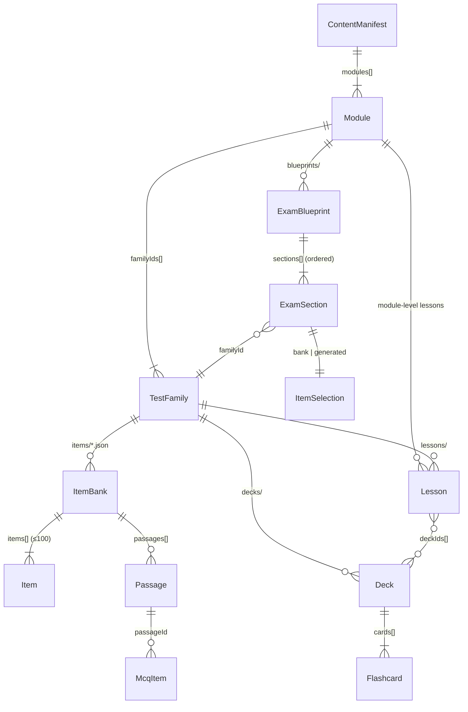
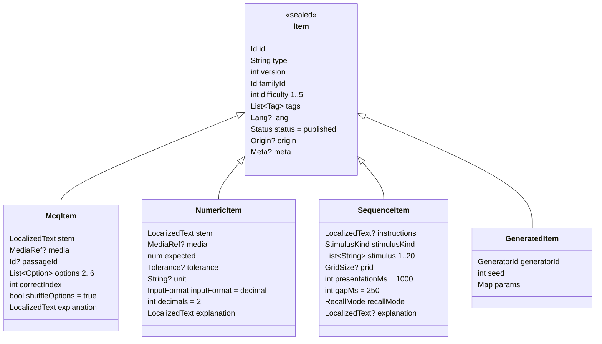

# Content contract (US-010) — schemaVersion 1

The single model shared by the test engines (EPIC-03), the learn UI (EPIC-04), the exam
runner (EPIC-06), the local database (EPIC-02) and the content authors (EPIC-08).
Machine-readable rules: [`schema/*.schema.json`](schema/) (JSON Schema draft 2020-12).
Author-facing rules: [AUTHORING.md](AUTHORING.md). Valid samples:
[`assets/content/examples/`](../../assets/content/examples/).

Status: **part 1 — JSON contract** (this document, the schemas, the examples) and
**part 2 — Dart models** (`lib/core/content/`, freezed + json_serializable, round-trip tests
against the examples) are both in place. §6 lists the types and where they live.

## 1. Entities



| Entity | File | Schema | Notes |
|---|---|---|---|
| `ContentManifest` | `assets/content/manifest.json` | `manifest.schema.json` | `schemaVersion`, `contentVersion`, `modules`, `changelog` |
| `Module` | `<module>/module.json` | `family.schema.json#/$defs/Module` | `psy0` / `psy1` / `psy2`; ordered `familyIds`, `defaultBlueprintId` |
| `TestFamily` | `<module>/<family>/family.json` | `family.schema.json` | `engineType`, `answerFormat`, `defaultDurationSec`, `defaultItemCount`, `defaultPerItemTimeSec?`, `confidence` |
| `ItemBank` (file) | `<module>/<family>/items/*.json` | `bank.schema.json` | `familyId`, `passages[]`, `items[]` (1–100) |
| `Item` (sealed) | inside a bank | `item.schema.json` | discriminator `type` |
| `Passage` | inside a bank | `item.schema.json#/$defs/Passage` | shared reading text |
| `Lesson` | `<module>/(<family>/)lessons/*.json` (+ `.md`) | `lesson.schema.json` | `body` inline **or** `file` refs |
| `Deck` + `Flashcard` | `<module>/<family>/decks/*.json` | `deck.schema.json`, `flashcard.schema.json` | cards inline in the deck |
| `ExamBlueprint` + `ExamSection` | `<module>/blueprints/*.json` | `blueprint.schema.json` | sections ordered; `ItemSelection` is `bank` or `generated` |

Common value types (`common.schema.json`): `Id`, `ModuleId`, `Version`, `Difficulty` (1–5),
`Tag`/`Tags`, `LocalizedText`, `LocalizedPath`, `AssetPath`, `MediaRef`, `Confidence`,
`Lang`, `Meta`, `Status`.

Every content entity carries `id` and `version`; items and flashcards also carry
`difficulty` and `tags` (mandatory); lessons, decks, families and blueprints carry `tags`
and an optional `difficulty` where it makes sense (lesson level).

## 2. The sealed `Item` hierarchy



Design rules:

- **`type` is the discriminator** (`mcq` | `numeric` | `sequence` | `generated`) — in Dart a
  freezed union with `unionKey: 'type'`.
- **Every concrete item is self-scoring**: `McqItem.correctIndex`, `NumericItem.expected` +
  `tolerance`, `SequenceItem.stimulus` + `recallMode`. The engine's `Scorer` never needs
  anything outside the item.
- **`GeneratedItem` is a recipe, not a question.** The runtime asks the generator registered
  under `generatorId` (US-020) to *materialise* it into a `McqItem` / `NumericItem` /
  `SequenceItem` whose `origin = {generatorId, seed}` and whose id is
  `gen.<generatorId>.<seed>`. Materialised items are never written to bank files; attempts store
  `origin` so they can be replayed (US-011 `attempts.itemId or generator+seed`).
- **Reading passages** are bank-level `Passage`s referenced by `passageId`; items sharing a
  passage are presented together in file order (US-027).
- **Feedback policy is not in the item.** `explanation` is always authored; whether it is shown
  is decided by the session mode (practice vs exam), per the EPIC-03 principle.
- Options can be text and/or media so logic/spatial figure options work without a new type;
  procedurally drawn figures (US-024/025) come from generators and carry their drawing spec in
  the materialised item's `params`-derived fields, not in JSON assets.

## 3. Families, engines and generators

`TestFamily.engineType` keys the engine registry (US-020). Bank engines (`mcq_bank`,
`numeric_bank`) read items from files; every other engine is a generator and also serves as
`generatorId` for `GeneratedItem`s and blueprint sections.

| `engineType` / `generatorId` | Family (PSY0) | Story | Produces |
|---|---|---|---|
| `mcq_bank` | english, maths_physics, verbal | US-027/028/030 | `McqItem` from bank |
| `numeric_bank` | maths_physics | US-028 | `NumericItem` from bank |
| `mental_arithmetic` | mental_arithmetic | US-023 | `NumericItem` |
| `logic_series` | logic | US-024 | `McqItem` or `NumericItem` |
| `figure_matrix` | logic | US-024 | `McqItem` (procedural figures) |
| `spatial_rotation`, `cube_folding` | spatial | US-025 | `McqItem` |
| `memory_digit_span`, `memory_pattern`, `memory_sequence` | memory | US-026 | `SequenceItem` |
| `attention_symbols`, `attention_stream` | attention | US-029 | engine-specific (P1) |
| `multitasking`, `instrument_reading` | PSY1 | US-101/102 | reserved |

Adding an engine type = adding an enum value here and in `family.schema.json` = a contract
change (§5).

## 4. Locale handling

- `LocalizedText = { fr: String, en?: String }`. **`fr` is mandatory** and is the fallback.
  The keys mean *"text shown to a user whose UI locale is X"* — for the English test the
  English sentence lives under `fr` (a French-UI candidate sees English), `en` is usually
  omitted.
- `Item.lang` / `Passage.lang` / `TestFamily.lang` (`fr` | `en`) give the language of the
  **stimulus** for text direction, hyphenation, TTS and sampling (US-030 wants FR and EN verbal
  items; sample by `lang`). Defaults: item ← family ← `fr`.
- Resolution in Dart: `LocalizedText.resolve(Locale uiLocale) => en ?? fr` when `uiLocale`
  is `en`, else `fr`. UI chrome strings are ARB-based (US-091) and never come from content.
- Lesson bodies follow the same rule through `LocalizedPath` (`.fr.md` mandatory, `.en.md`
  optional).

## 5. Versioning rules

Three independent numbers:

| Number | Where | Bumped when | Consumer |
|---|---|---|---|
| `schemaVersion` | manifest | the JSON contract changes incompatibly (renamed/removed field, new required field, new enum value the app must handle) | app refuses unknown versions at seed time; Dart models + schemas + this doc change in the same PR |
| `contentVersion` | manifest | anything under `assets/content/` must reach users | seeder re-seeds when bundled > stored (US-013); user data untouched |
| `version` | every entity | the entity's *meaning* changes (correct answer, options, rewording that changes the question) | analytics treat (id, version) as the question identity; `item_stats` are keyed by id and reset on version change (decision for US-011/US-075) |

Compatibility policy for the JSON contract:

- **Additive optional fields do not bump `schemaVersion`** — Dart models must ignore unknown
  keys (`json_serializable` default) and schemas set `additionalProperties: false` only for
  authoring hygiene, which the validator enforces, not the app.
- Enum additions (`engineType`, `stimulusKind`, tags) are treated as breaking for the app
  that must render them → bump.
- Removing or renaming a field → bump, plus a migration note in the manifest `changelog`.
- Ids are permanent. Renaming an id is a content deletion + creation.

## 6. Dart types (part 2)

Package: `lib/core/content/` (cross-cutting, no UI — see ARCHITECTURE.md), pure Dart, no
Flutter import. Import the barrel `package:psy_trainer/core/content/content.dart`. All
classes are `@freezed`, immutable, with `fromJson`/`toJson`; the sealed unions use
`unionKey`. Names are frozen so other lanes can code against them.

| File | Types |
|---|---|
| `lib/core/content/model/common.dart` | `LocalizedText`, `LocalizedPath`, `MediaRef`, `MediaKind`, `ModuleId`, `Confidence`, `ContentLang`, `ContentStatus`, `ContentMeta`, `Difficulty` (+ `difficultyFromJson`), `DateOnlyConverter` |
| `lib/core/content/model/content_manifest.dart` | `ContentManifest`, `ChangelogEntry` |
| `lib/core/content/model/module.dart` | `Module` |
| `lib/core/content/model/test_family.dart` | `TestFamily`, `EngineType`, `AnswerFormat` |
| `lib/core/content/model/item.dart` | `ItemBank`, `Passage`, `Item` (sealed: `McqItem`, `NumericItem`, `SequenceItem`, `GeneratedItem`), `McqOption`, `Tolerance`, `ToleranceMode`, `InputFormat`, `StimulusKind`, `RecallMode`, `GridSize`, `ItemOrigin` |
| `lib/core/content/model/lesson.dart` | `Lesson` |
| `lib/core/content/model/deck.dart` | `Deck`, `Flashcard` |
| `lib/core/content/model/exam_blueprint.dart` | `ExamBlueprint`, `ExamSection`, `ItemSelection` (sealed: `BankSelection`, `GeneratedSelection`), `DifficultyRange` |
| `lib/core/content/content_bundle_parser.dart` | `ContentBundleParser` — `parseManifest/Module/Family/Bank/Lesson/Deck/Blueprint(source, file:)`; checks `kind`, ignores `$schema`, throws `ContentParseException(file, entityId, message)` |
| `lib/core/content/content_parse_exception.dart` | `ContentParseException` |

Generated `*.freezed.dart` / `*.g.dart` are committed and excluded from analysis
(`make gen` regenerates them). Tests: `test/core/content/` — every file in
`assets/content/examples/` must parse and re-serialise to the same JSON (key order aside;
schema defaults such as `status`, `shuffleOptions`, `params` may be filled in).

Implementation notes:

- `Item` is discriminated by `type`; `ItemSelection` by `mode` (as in the schemas).
- `kind` and `$schema` are file-level keys handled by the parser, not model fields.
- Date-only strings (`updatedAt`, `changelog[].date`, `meta.reviewedAt`) become UTC-midnight
  `DateTime`s via `DateOnlyConverter` and serialise back to `YYYY-MM-DD`.
- `difficulty` is decoded through `difficultyFromJson`, which rejects values outside 1–5 in
  every build mode; constructors additionally `assert` the range, `correctIndex <
  options.length`, `gridCells ⇒ grid`, and `Lesson.body xor file`.
- Unknown JSON keys are ignored (additive fields do not bump `schemaVersion`, §5).

```dart
// Value types (common.schema.json)
class LocalizedText { String fr; String? en; String resolve(String locale); }
class MediaRef      { MediaKind kind; String path; LocalizedText? alt; int? width; int? height; int? durationMs; }
enum ModuleId       { psy0, psy1, psy2 }
enum Confidence     { confirmed, reported, assumed }
enum ContentLang    { fr, en }
enum ContentStatus  { draft, published }
class ContentMeta   { String? author; String? source; String? reviewedBy; DateTime? reviewedAt; String? notes; }
typedef Difficulty = int; // 1..5, checked by difficultyFromJson and asserted in constructors

// Structure
class ContentManifest { int schemaVersion; int contentVersion; DateTime updatedAt; List<ModuleId> modules; List<ChangelogEntry> changelog; }
class Module          { ModuleId id; int version; int order; LocalizedText name, description; List<String> familyIds; String? defaultBlueprintId; ContentStatus status; }
class TestFamily      { String id; ModuleId moduleId; int version; int order; LocalizedText name, description; LocalizedText? shortName;
                        EngineType engineType; AnswerFormat answerFormat; ContentLang lang; int defaultDurationSec; int defaultItemCount;
                        int? defaultPerItemTimeSec; Confidence confidence; List<String> tags; ContentStatus status; ContentMeta? meta; }
enum EngineType   { mcqBank, numericBank, mentalArithmetic, logicSeries, figureMatrix, spatialRotation, cubeFolding,
                    memoryDigitSpan, memoryPattern, memorySequence, attentionSymbols, attentionStream, multitasking, instrumentReading }
enum AnswerFormat { mcq, numeric, sequence, grid, tap }

// Items (item.schema.json, bank.schema.json)
class ItemBank { String familyId; List<Passage> passages; List<Item> items; }
class Passage  { String id; LocalizedText? title; LocalizedText body; MediaRef? media; ContentLang? lang; }
sealed class Item { String id; int version; String familyId; int difficulty; List<String> tags; ContentLang? lang;
                    ContentStatus status; ItemOrigin? origin; ContentMeta? meta; }
  class McqItem       extends Item { LocalizedText stem; MediaRef? media; String? passageId; List<McqOption> options; int correctIndex; bool shuffleOptions; LocalizedText explanation; }
  class NumericItem   extends Item { LocalizedText stem; MediaRef? media; num expected; Tolerance? tolerance; String? unit; InputFormat inputFormat; int decimals; LocalizedText explanation; }
  class SequenceItem  extends Item { LocalizedText? instructions; StimulusKind stimulusKind; List<String> stimulus; GridSize? grid; int presentationMs; int gapMs; RecallMode recallMode; LocalizedText? explanation; }
  class GeneratedItem extends Item { String generatorId; int seed; Map<String, Object?> params; }
class McqOption  { LocalizedText? text; MediaRef? media; }
class Tolerance  { ToleranceMode mode; num value; }   enum ToleranceMode { absolute, relative }
enum InputFormat { integer, decimal, time }
enum StimulusKind { digits, letters, symbols, colors, gridCells }
enum RecallMode   { forward, backward, anyOrder }
class GridSize    { int rows, cols; }
class ItemOrigin  { String generatorId; int seed; }

// Learn (lesson.schema.json, deck.schema.json, flashcard.schema.json)
class Lesson    { String id; int version; ModuleId moduleId; String? familyId; int order; LocalizedText title; LocalizedText? summary;
                  LocalizedText? body; LocalizedPath? file; int? estimatedReadMin; int? difficulty; List<String> tags; List<String> practiceTags; List<String> deckIds; ContentStatus status; ContentMeta? meta; }
class LocalizedPath { String fr; String? en; }
class Deck      { String id; int version; ModuleId moduleId; String familyId; int order; LocalizedText name; LocalizedText? description; List<String> tags; List<Flashcard> cards; ContentStatus status; ContentMeta? meta; }
class Flashcard { String id; int version; String deckId; LocalizedText front, back; MediaRef? media; int difficulty; List<String> tags; ContentStatus status; ContentMeta? meta; }

// Exam (blueprint.schema.json)
class ExamBlueprint { String id; int version; ModuleId moduleId; LocalizedText name, description; Confidence confidence; List<String> tags; int briefingSec; List<ExamSection> sections; ContentStatus status; ContentMeta? meta; }
class ExamSection   { String id; String familyId; LocalizedText? title, instructions; int durationSec; int itemCount; int? perItemTimeSec;
                      ItemSelection itemSelection; int breakAfterSec; Confidence confidence; double weight; }
sealed class ItemSelection { }
  class BankSelection      extends ItemSelection { DifficultyRange? difficulty; List<String>? tags; List<String>? anyTags; String? balanceByTagPrefix; int avoidRecentSessions; }
  class GeneratedSelection extends ItemSelection { String generatorId; DifficultyRange difficulty; Map<String, Object?> params; }
class DifficultyRange { int min, max; }
```

JSON ↔ Dart naming: JSON is camelCase and maps 1:1 to field names; enums serialise to the
snake_case strings used in the schemas (`mcq_bank` ↔ `EngineType.mcqBank`,
`gridCells` ↔ `StimulusKind.gridCells`).

## 7. What consumers should rely on

- **Engines (EPIC-03):** `Item` union + `Scorer` per subtype; `GeneratedItem`/`ItemSelection`
  give `(generatorId, seed, params, difficulty)`; `TestFamily.engineType` keys the registry.
- **Learn UI (EPIC-04):** `Module → TestFamily → Lesson[] / Deck[]`, `LocalizedText.resolve`,
  callout convention in AUTHORING §10, `Lesson.practiceTags` / `deckIds` for cross-links.
- **Practice/Exam UI (EPIC-05/06):** `ExamBlueprint.sections` drive briefing/timer/break;
  `TestFamily.default*` drive the practice launcher; `Confidence` shows "estimated".
- **DB (EPIC-02):** entities are stored as-is (JSON columns) plus indexed columns
  `familyId`, `difficulty`, `type`, `version`; `Origin` for generated attempts.
- **Analytics (EPIC-07):** `tags` second level = the "weak area" grain; `(id, version)` is the
  question identity.
