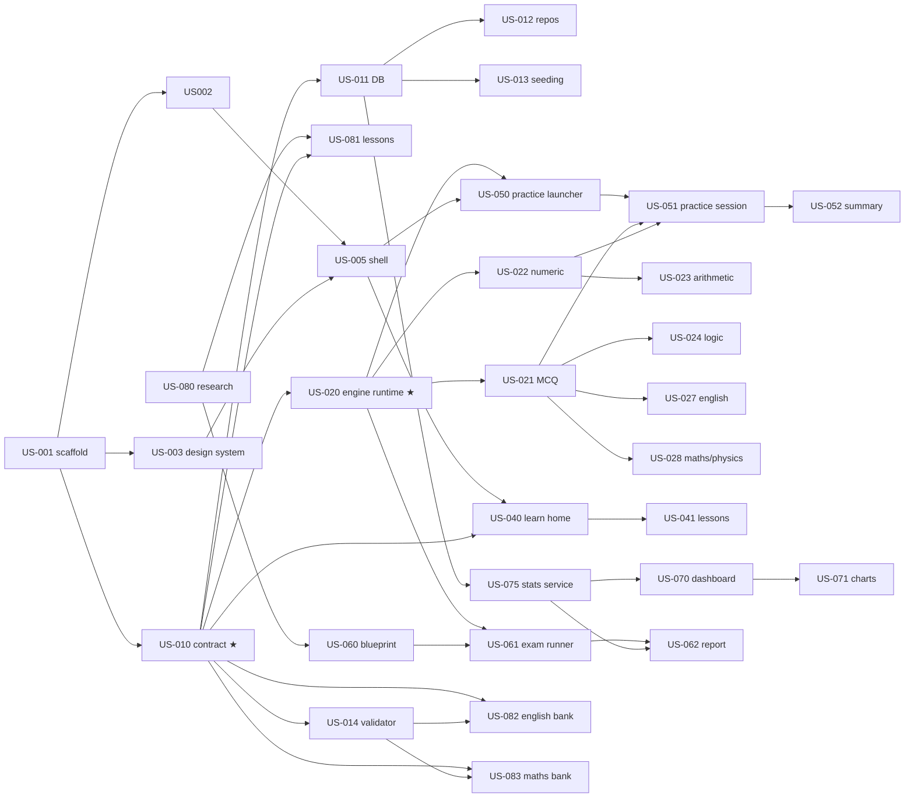

# Roadmap & parallelisation plan

## Milestones

| Milestone | Goal | Stories |
|---|---|---|
| **M0 — Foundation** (week 1) | App runs, contract frozen, CI green | US-080, US-001, US-002, US-003, US-004, US-005, US-010, US-011, US-012, US-014 |
| **M1 — PSY0 MVP** | Learn + Practice + Exam sim + Progress on 4 families (mental arithmetic, logic, English, maths/physics) | US-013, US-020…024, US-027, US-028, US-040, US-041, US-050…052, US-060…062, US-070, US-071, US-075, US-081…083, US-090 |
| **M2 — PSY0 complete** | All families, flashcards, retry, weak areas, i18n, release builds | US-025, US-026, US-030, US-042…044, US-054, US-064, US-072, US-084…087, US-091, US-120…122 |
| **M3 — Polish** | Adaptive difficulty, realism, streaks, backup, a11y | US-029, US-053, US-063, US-073, US-074, US-092, US-093, US-123 |
| **M4 — PSY1** | Multitasking / instrument engines | US-100…103 |
| **M5 — PSY2** | Interview & group prep | US-110…112 |
| **M6 — Remote** | Sync (not scheduled) | US-130 |

## Parallel lanes

The project is cut so that after **M0** (≈ 1 week, ideally 2 people: one on scaffold/DB, one on
design system + research), six lanes can run at the same time with almost no coordination:

| Lane | Owner profile | Needs first | Cards |
|---|---|---|---|
| `core` | Flutter dev (architecture) | — | US-001, 002, 004, 005, 010, 011, 012, 013, 120–122 |
| `design` | UI-minded dev | US-001 | US-003, 123 |
| `engines` | Flutter/Dart dev, likes algorithms | US-010 → US-020 | US-020–030 (one family per person once US-020 is merged) |
| `learn-ui` | Flutter dev (UI) | US-005, US-010 | US-040–044 |
| `train-ui` / `exam-ui` | Flutter dev (UI + state) | US-020 + one renderer | US-050–054, US-060–064 |
| `analytics` | Dart dev (SQL/stats) | US-011 | US-075 first (no UI needed), then US-070–074 |
| `content` | **Non-developer OK** | US-010 + US-014 | US-080–087 (one family per author) |

Key facts about the cut:

- **US-010 is the single sync point.** Engines, learn UI and content authors only need the
  contract, not each other's code.
- **US-020 (engine runtime) is the second gate**, only for `engines` and `train/exam-ui`.
  While it is being built, `analytics` builds US-075 against the DB, `learn-ui` builds US-040/041,
  `content` writes lessons and banks.
- Engines are **independent of each other**: US-023, 024, 025, 026, 029 can each be taken by a
  different person the day US-020 merges. US-027/028/030 are thin (bank-driven) and can be done
  by whoever finishes first.
- Practice UI (US-051) only needs *one* engine to be testable — start with US-023 (simplest).
- Exam runner (US-061) reuses the same renderers; it can be built with fake generators before
  real engines exist.

## Dependency graph (M0 → M1)

★ = synchronisation points.

## Suggested order for a solo developer

1. US-080 (half a day) → US-001 → US-010 → US-011 → US-012 → US-003 → US-002 → US-005
2. US-020 → US-022 → US-023 → US-050 → US-051 → US-052 (first end-to-end drill)
3. US-075 → US-070 → US-071 (progress visible)
4. US-021 → US-024 → US-027 → US-028 (+ content US-082/083 in the evenings)
5. US-060 → US-061 → US-062 (exam sim)
6. US-013 → US-040 → US-041 → US-081, then M2.
